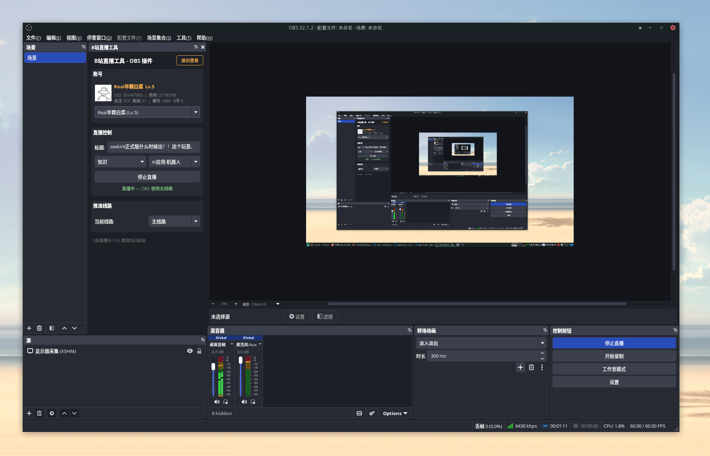

# B站直播工具 — OBS 插件



C++ 原生 OBS 插件，提供 B站直播控制面板：扫码登录、标题/分区设置、一键开播/停播、RTMP 推流信息、实时弹幕显示。

## 安装

### DEB (Ubuntu/Debian)

从 [Releases](https://github.com/devcxl/bilibili-live-obs-plugin/releases) 下载 `.deb` 包：

```bash
sudo dpkg -i bilibili-live-obs_*.deb
```

### 从旧版本升级（包名与安装路径已变更）

旧版本使用 `bili-live-obs` / `libbili-live-obs.so` / `/usr/share/obs/obs-plugins/bili-live-obs`，
必须先卸载，否则会与新版插件同时加载并冲突：

```bash
# dpkg -r 会移除包内文件（/usr/lib/<multiarch>/obs-plugins/libbili-live-obs.so）
sudo dpkg -r bili-live-obs
# 若曾手动拷贝过插件或数据目录，一并清理
sudo rm -f /usr/lib/obs-plugins/libbili-live-obs.so
sudo rm -rf /usr/share/obs/obs-plugins/bili-live-obs
```

> 另：加密 salt 已变更，升级后需重新扫码登录。

### 从源码编译

```bash
# 依赖
sudo apt install cmake ninja-build g++ pkg-config \
  libobs-dev libobs-frontend-api-dev \
  qtbase5-dev libcurl4-openssl-dev libqrencode-dev libssl-dev

# 编译
cmake -B build -G Ninja -DCMAKE_BUILD_TYPE=Release
cmake --build build

# 安装
sudo cp build/libbilibili-live-obs.so /usr/lib/obs-plugins/
```

## 使用

1. 重启 OBS
2. 菜单 **停靠窗口 → B站直播工具**
3. **扫码登录** — 点击按钮，用 B站客户端扫码确认
4. **配置直播** — 填写标题，选择分区
5. **开播** — 点击「开始直播」，复制推流地址/推流码到 OBS 设置
6. **停播** — 点击「停止直播」

> OBS 的「停止串流」不会结束 B站直播，需在面板中操作。

## 账号说明

- 插件**仅支持单账号**：同一时间只有一个登录态，不支持多账号切换
- 登录后右上角显示退出按钮，点击清除登录态

## 项目结构

```
├── CMakeLists.txt           # 构建系统
├── src/
│   ├── plugin-main.cpp      # OBS 入口
│   ├── config-manager.h/.cpp # 配置持久化 + 加密
│   ├── bilibili-api.h/.cpp   # HTTP 客户端 + B站 API
│   ├── auth-service.h/.cpp   # 登录/用户/直播服务
│   └── bili-dock.h/.cpp      # Qt5 面板 UI
├── data/                     # locale 等运行时数据
└── .github/workflows/        # CI 自动构建 + Release
```